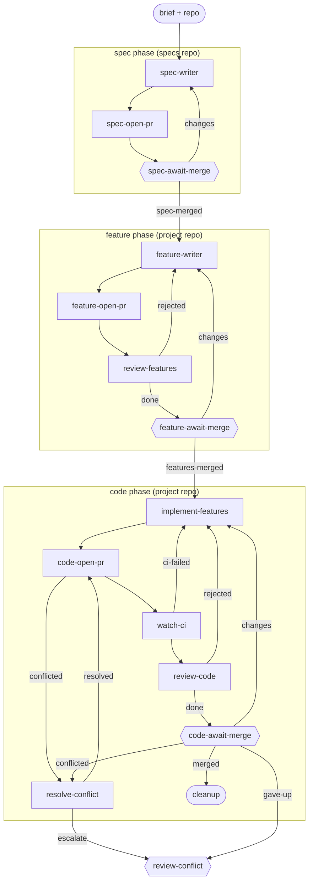

# bdd-driven

**A behaviour-first variant of [spec-driven](spec-driven.md): three PRs, three gates.** The spec still comes first and is reviewed on its own PR, but the executable acceptance criteria are then written as gherkin `.feature` scenarios on a second PR - reviewed and agreed _before_ any code exists. The coder then implements to the spec and makes those (frozen) scenarios pass. The scenarios are the executable contract; the spec is the design intent the code is reviewed against.

**Use it when** you want the acceptance criteria pinned as executable scenarios and agreed before implementation - behaviour-driven development, where "what it must do" is settled and falsifiable up front.

**Phases:** `spec` (specs repo), then `feature` and `code` (both the project repo, as two distinct phases so each gets its own PR and branch). Scenarios are tagged `@wip` so CI skips them until the code exists; `implement-features` removes the tag as each scenario goes green.

The graph is `workflows/bdd-driven.md`; the role prompts are in `steps/*.md`. The spec and code phases reuse spec-driven's steps; only the feature phase and the coder differ.

## Flow

Node shape shows who runs each stage: `[ agent-step ]` an ephemeral agent claims and completes it; `{{ human-gate }}` a human decides (the driver assists); `([ start / terminal ])` the item's inputs or where the flow ends. Edge labels are outcomes; edges back to an earlier stage are rework loops. Merge, CI-failure, and conflict transitions are driven by engine hooks watching the PR - folded into the labelled edges here; exact wiring is in the graph file.

## Steps

| Step | Who | Does |
| --- | --- | --- |
| `spec-writer` -> `spec-await-merge` | agent / human | Same as spec-driven: spec authored and merged on the spec PR. |
| `feature-writer` | agent | Derives pure gherkin `.feature` scenarios from the merged spec, tagged `@wip` so CI skips them; no glue code. |
| `feature-open-pr` | agent | Opens the feature PR. |
| `review-features` | agent | Reviews the scenarios against the spec - coverage, depth, faithfulness, `@wip` tags - and primes the human gate; bounces back to `feature-writer` on gaps. |
| `feature-await-merge` | human | Reviews and merges the scenarios (the second gate) - behaviour agreed before code. |
| `implement-features` | agent | Implements to the spec _and_ makes every scenario pass; may only remove `@wip`, never edit a scenario (a wrong scenario is a `feature-writer` defect, routed back, not patched). |
| `code-open-pr` -> `cleanup` | agent / human | Same as spec-driven: code PR, CI, review, human merge. |
