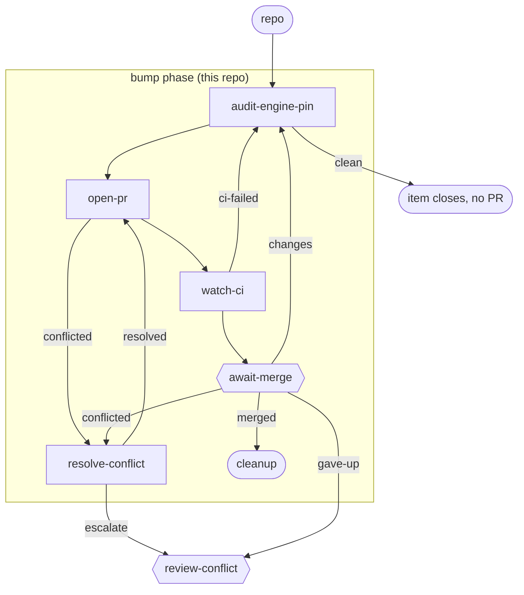

# bump-engine-pin

**One item, one id, one phase, one PR.** `audit-engine-pin` compares this repo's `ENGINE_PIN` (in `.github/workflows/simulate.yml`) against `kenmclennan/lightcycle`'s own `main`. At or below the configured threshold there is nothing to do and the item closes unattended, no PR opened. Above threshold it bumps `ENGINE_PIN` to the engine's current `main` sha and the rest of the flow is the same generic PR/CI machinery every other bundle here already has.

**Use it when** the nightly `engine-pin-stale` issue, or the gate's own hard failure past threshold, tells you `ENGINE_PIN` is behind - file it with `lc new item "bump ENGINE_PIN (<n> commits behind)" --workflow lightcycle/bump-engine-pin --repo <this repo>`.

**Phases:** `bump` (this repo) only - no spec phase; the check and the fix are the same deterministic, non-creative act.

The graph is `workflows/bump-engine-pin.md`; the step prompts are in `steps/*.md`.

## Flow

Node shape shows who runs each stage: `[ agent-step ]` an ephemeral agent claims and completes it; `{{ human-gate }}` a human decides (the driver assists); `([ start / terminal ])` the item's inputs or where the flow ends. Edge labels are outcomes; edges back to an earlier stage are rework loops. Merge, CI-failure, and conflict transitions are driven by engine hooks watching the PR - folded into the labelled edges here; exact wiring is in the graph file.

## Steps

| Step | Who | Does |
| --- | --- | --- |
| `audit-engine-pin` | agent | Reads `ENGINE_PIN` and the staleness threshold off `origin/main`'s `simulate.yml`, computes how many commits behind `kenmclennan/lightcycle` main it is. At or below threshold, closes the item itself (`clean`) - no PR. Above threshold, bumps `ENGINE_PIN` to the engine's current `main` sha and commits. |
| `open-pr` | agent | Rebases on main, pushes, opens the PR. |
| `watch-ci` | agent | Watches the `simulate` CI job - the bump PR validates itself against the new pin end to end; routes failures back to `audit-engine-pin` (capped, then `review-ci`). |
| `await-merge` | human | Merges the PR, or routes changes/feedback back. |
| `resolve-conflict` / `review-conflict` | agent / human | Handle a PR that hits a merge conflict (escalating to a human past the cap). |
| `cleanup` | terminal | The item is merged and done. |
