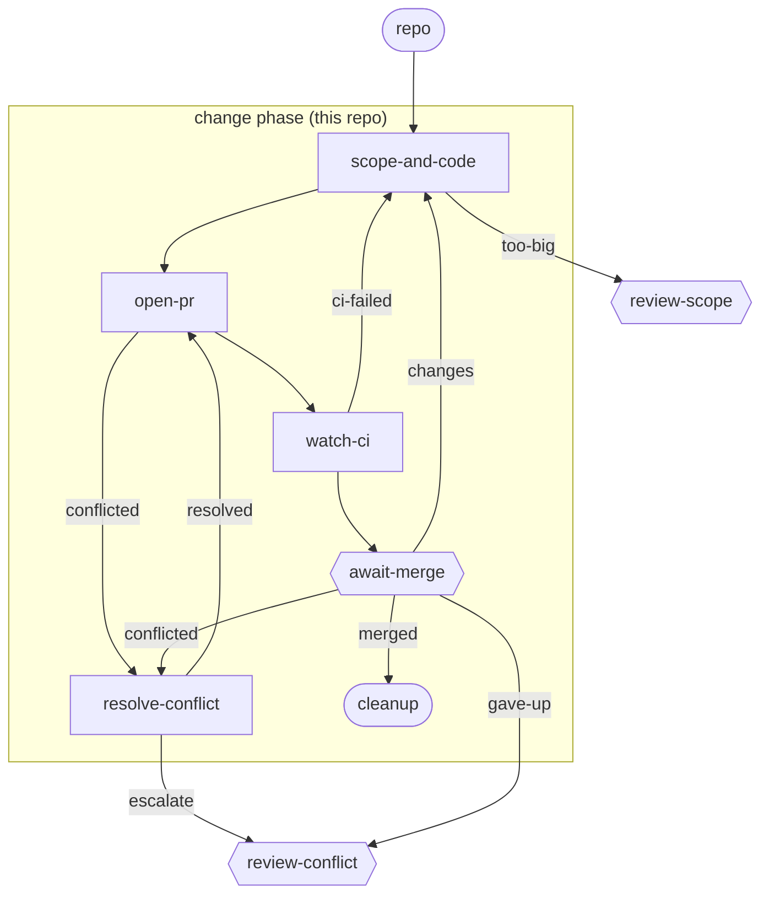

# small-change

**One item, one id, one phase, one PR.** `scope-and-code` reads the brief straight off the item's own description - no spec, no spec PR - decides the approach, and writes the code. `done` when the change is built; `too-big` when the brief needs more than a single-PR, no-spec lane can carry. From there it's the same generic PR/CI machinery every other bundle here already has: open a PR, watch CI, human reviews and merges, cleanup closes the item.

**Use it when** a change is small and low-risk enough that a written spec and a separate agent review round would cost more than they'd ever catch - file it with `lc new item "<title>" --workflow lightcycle/small-change --repo <this repo>`.

**Phases:** `change` (this repo) only - no spec phase; scoping and coding happen in the same stage. There is deliberately no agent code-review stage between `watch-ci` and `await-merge` - the changes this lane is for should be small and simple enough to review at the PR gate itself, and `too-big` is the mechanism that keeps them that way.

The graph is `workflows/small-change.md`; the step prompts are in `steps/*.md`.

## Flow

Node shape shows who runs each stage: `[ agent-step ]` an ephemeral agent claims and completes it; `{{ human-gate }}` a human decides (the driver assists); `([ start / terminal ])` the item's inputs or where the flow ends. Edge labels are outcomes; edges back to an earlier stage are rework loops. Merge, CI-failure, and conflict transitions are driven by engine hooks watching the PR - folded into the labelled edges here; exact wiring is in the graph file.

## Steps

| Step | Who | Does |
| --- | --- | --- |
| `scope-and-code` | agent | Reads the brief off the item's own description, decides whether it fits one PR with no design review, and writes the code. `too-big` routes to a human rather than building oversized work; on a rework it captures and reconciles a per-file test/step-def inventory so a rework round can't silently drop a test. |
| `open-pr` | agent | Rebases on main, pushes, opens the PR. |
| `watch-ci` | agent | Watches CI; routes failures back to `scope-and-code` (capped, then `review-ci`). |
| `await-merge` | human | Merges the PR, or routes changes/feedback back. |
| `resolve-conflict` / `review-conflict` | agent / human | Handle a PR that hits a merge conflict (escalating to a human past the cap). |
| `review-scope` | human | The brief turned out bigger than this lane should carry - decide whether to refile it under `spec-driven`. |
| `cleanup` | terminal | The item is merged and done. |
