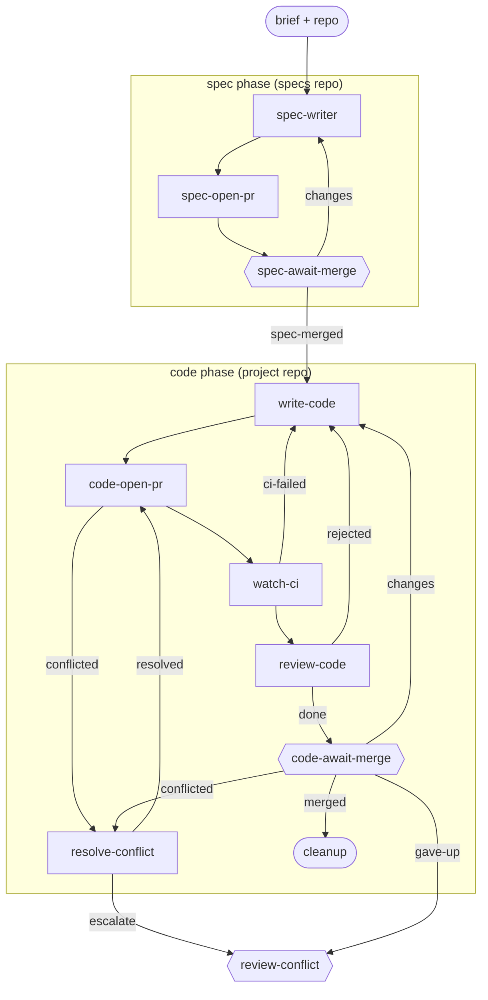

# spec-driven

**One item, one id, from brief to merged code, through two PRs.** A brief settled in co-design becomes a formal spec on a spec PR; once that merges, the same item continues into the code build. The spec PR is the single human review gate before code; the code PR is the merge gate.

**Use it when** the design is best captured as a prose spec that a human reviews and merges before any code is written.

**Phases:** `spec` (specs repo) then `code` (project repo). `open-pr` and `await-merge` appear once per phase.

The graph is `workflows/spec-driven.md`; the role prompts are in `steps/*.md`.

## Flow

Node shape shows who runs each stage: `[ agent-step ]` an ephemeral agent claims and completes it; `{{ human-gate }}` a human decides (the driver assists); `([ start / terminal ])` the item's inputs or where the flow ends. Edge labels are outcomes; edges back to an earlier stage are rework loops. Merge, CI-failure, and conflict transitions are driven by engine hooks watching the PR - folded into the labelled edges here; exact wiring is in the graph file.

## Steps

| Step | Who | Does |
| --- | --- | --- |
| `spec-writer` | agent | Formalizes the brief into a spec on a branch in the specs repo. |
| `spec-open-pr` / `spec-await-merge` | agent / human | Opens the spec PR; the human reviews and merges it (the review gate). |
| `write-code` | agent | Implements the spec so every acceptance check passes. |
| `code-open-pr` | agent | Rebases on main, pushes, opens the code PR. |
| `watch-ci` | agent | Watches CI; routes failures back to `write-code` (capped, then `review-ci`). |
| `review-code` | agent | Reviews the diff against the spec and primes the human gate; bounces back on defects. |
| `code-await-merge` | human | Merges the code PR, or routes changes/feedback back. |
| `resolve-conflict` / `review-conflict` | agent / human | Handle a PR that hits a merge conflict (escalating to a human past the cap). |
| `cleanup` | terminal | The item is merged and done. |
