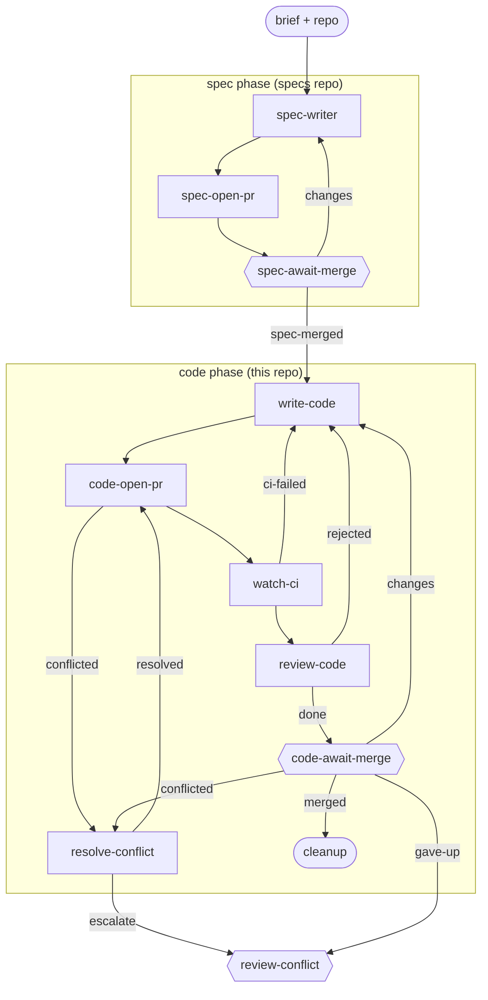

# workflow-authoring

**One item, one id, from a workflow design to a merged bundle, through two PRs.** A brief settled in co-design becomes a formal workflow-design spec - a mermaid flowchart plus a description of each step, gate, and trigger - on a spec PR; once that merges, the same item authors the bundle (invoking the `lightcycle:author-workflow` skill) and gets it merged on a code PR, gated by `lc workflow check` and `lc workflow simulate` rather than a test suite.

**Use it when** building or updating a workflow bundle in this origin - a new workflow, an adaptation of an existing one, or a fork - and you want the design reviewed before the bundle is authored.

**Phases:** `spec` (specs repo) then `code` (this repo). `open-pr` and `await-merge` appear once per phase.

The graph is `workflows/workflow-authoring.md`; the role prompts are in `steps/*.md` - reused unchanged from `spec-driven`; see this repo's `CLAUDE.md` ("Authoring a workflow in this repo") for how each step's generic behavior specializes for a workflow build.

## Flow

Node shape shows who runs each stage: `[ agent-step ]` an ephemeral agent claims and completes it; `{{ human-gate }}` a human decides (the driver assists); `([ start / terminal ])` the item's inputs or where the flow ends. Edge labels are outcomes; edges back to an earlier stage are rework loops. Merge, CI-failure, and conflict transitions are driven by engine hooks watching the PR - folded into the labelled edges here; exact wiring is in the graph file. The shape is identical to `spec-driven`'s - only what happens inside each stage differs.

## Steps

| Step | Who | Does |
| --- | --- | --- |
| `spec-writer` | agent | Formalizes the brief into a workflow-design spec (mermaid + step/gate/trigger descriptions) on a branch in the specs repo. |
| `spec-open-pr` / `spec-await-merge` | agent / human | Opens the spec PR; the human reviews the design and merges it (the review gate). |
| `write-code` | agent | Authors the bundle to match the approved design, invoking the `lightcycle:author-workflow` skill. |
| `code-open-pr` | agent | Rebases on main, pushes, opens the code PR. |
| `watch-ci` | agent | Watches the `simulate` CI job; routes failures back to `write-code` (capped, then `review-ci`). |
| `review-code` | agent | Verifies `lc workflow check` and `lc workflow simulate` pass, and that `lc workflow describe --mermaid` matches the design mermaid; primes the human gate; bounces back on defects. |
| `code-await-merge` | human | Merges the code PR, or routes changes/feedback back. |
| `resolve-conflict` / `review-conflict` | agent / human | Handle a PR that hits a merge conflict (escalating to a human past the cap). |
| `cleanup` | terminal | The item is merged and done. |
