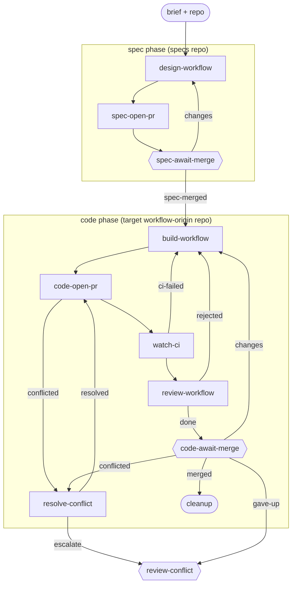

# workflow-authoring

**One item, one id, from a workflow design to a merged bundle, through two PRs.** A brief settled in co-design becomes a formal workflow-design spec - a mermaid flowchart plus a description of each step, gate, and trigger - on a spec PR; once that merges, the same item builds the bundle and gets it merged on a code PR, gated by `lc workflow check` and `lc workflow simulate` rather than a test suite.

**Use it when** building or updating a workflow bundle in this origin - a new workflow, an adaptation of an existing one, or a fork - and you want the design reviewed before the bundle is built.

**Phases:** `spec` (specs repo) then `code` (the target workflow-origin repo). `open-pr` and `await-merge` appear once per phase.

The graph is `workflows/workflow-authoring.md`; the role prompts are in `steps/*.md`. `design-workflow`, `build-workflow`, and `review-workflow` carry the workflow-authoring craft (the design mermaid convention and grammar, the full grammar and hook catalog, the QA and agnostic-rule checklist) inline, so the bundle is self-contained and works from being pulled alone - no plugin, no target-repo `CLAUDE.md`, no engine source.

## Flow

Node shape shows who runs each stage: `[ agent-step ]` an ephemeral agent claims and completes it; `{{ human-gate }}` a human decides (the driver assists); `([ start / terminal ])` the item's inputs or where the flow ends. Edge labels are outcomes; edges back to an earlier stage are rework loops. Merge, CI-failure, and conflict transitions are driven by engine hooks watching the PR - folded into the labelled edges here; exact wiring is in the graph file.

## Steps

| Step | Who | Does |
| --- | --- | --- |
| `design-workflow` | agent | Draws the workflow-design spec (mermaid + step/gate/trigger descriptions) on a branch in the specs repo, carrying the design mermaid convention and grammar guardrails inline. |
| `spec-open-pr` / `spec-await-merge` | agent / human | Opens the spec PR; the human reviews the design and merges it (the review gate). |
| `build-workflow` | agent | Authors the bundle to match the approved design, carrying the full grammar, hook catalog, and self-contained-bundle rule inline. |
| `code-open-pr` | agent | Rebases on main, pushes, opens the code PR. |
| `watch-ci` | agent | Watches the `simulate` CI job; routes failures back to `build-workflow` (capped, then `review-ci`). |
| `review-workflow` | agent | Verifies `lc workflow check` and `lc workflow simulate` pass, that `lc workflow describe --mermaid` matches the design mermaid, and the agnostic-rule checks; primes the human gate; bounces back on defects. |
| `code-await-merge` | human | Merges the code PR, or routes changes/feedback back. |
| `resolve-conflict` / `review-conflict` | agent / human | Handle a PR that hits a merge conflict (escalating to a human past the cap). |
| `cleanup` | terminal | The item is merged and done. |
